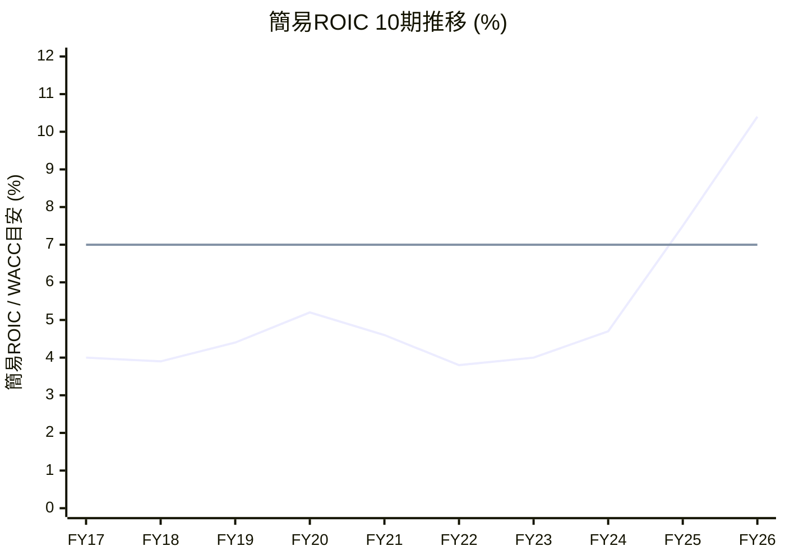

## 2026-07-05 ROIC評価規律の再現性テスト(1980ダイダンへのコア⑩付随ROIC評価ブロック追加)

### 実施内容
rules/corrections.md・mistakes.mdを先に確認(前回確認から変更なし)。

**ステップ0: Eq出力の確認**
- `fetch_stock.py`の財務10年出力を確認したところ、`equity`フィールド(J-Quants `Eq`列由来)は**既に含まれていた**(前回1-1指示より前から実装済みのフィールドで、今回のTA追加時に手を加えていない箇所)。追加作業・コミットは不要と判断し、確認のみで次へ進んだ。

**ステップ1: ROIC評価ブロックの作成**
- 対象ノートを事前に`.bak_20260705_roicblock`としてバックアップ
- `fetch_stock.py 1980`を実行し、財務10年の`roic_simple`(簡易ROIC)10期分を取得。全て前回のhandoff報告・fetch_stock.py改修時の検証値と一致(FY17=4.0〜FY26=10.4)
- 正規ROIC算出のため、決算短信PDF(`20260512_決算短信.pdf`、既取得済み・再利用)の貸借対照表から当期(FY26/3)有利子負債を確認: 短期借入金28.01億円+長期借入金7.20億円=35.21億円
- 無借金近似の可否判定: 自己資本(決算短信参考値130,473百万円)の5%=65.24億円 > 有利子負債35.21億円 → **適用可**
- 正規ROIC = NOPAT(営業利益344.79億円×0.70=241.35億円) ÷ 自己資本近似(Eq列1,328.79億円) = **18.2%**(WACC7%比 +11.2pt、水準ガイド「15–20%=モートあり」に該当)
- コア⑩直後に「### コア⑩付随 ROIC評価ブロック」を新設し、Mermaid xychart(簡易ROIC10期の折れ線+WACC7%の水平線)→簡易ROIC10期表→傾きの読み→正規ROIC算出、の順で記載
- vault commit `daa4731` — `1980ダイダン: コア⑩付随ROIC評価ブロックを追加(正典再現性テスト、既存ノート遡及適用の明示的例外)`(push済み)

### 正典の記述だけで迷わず作れたか／どこで解釈に迷ったか(必須項目)

**全体としては迷わず作業できたが、以下5点で正典の記述だけでは一意に決まらず、自分で解釈・補完した箇所がある**:

1. **「Eq列」と「自己資本」の同一視**: 軸⑭マスターは「投下資本≒自己資本（Eq列）」と、あたかも同じものであるかのように書いているが、実際にJ-Quants `Eq`列から返る値は**純資産(非支配株主持分を含む)**であり、決算短信が開示する厳密な「自己資本」(親会社所有者帰属持分)とは金額が異なる(1980の場合: Eq列132,879百万円 vs 決算短信の自己資本130,473百万円、差2,406百万円=約1.8%)。今回は正典の文言どおり「Eq列」の値をそのまま使ったが、両者を区別せず「Eq列」と書いている点は正典の記述と実データの意味にズレがあり、今回のような小さな乖離では最終判定(モートあり水準)に影響しなかったが、非支配株主持分の大きい銘柄では無視できない差になり得る。
2. **無借金近似の判定基準となる「当期の有利子負債」の取得元**: 軸⑭マスター単体には、この数値をどこから取るかの明記がない(EDINET由来という記述は正規計算の分母側の話で、5%判定の分子側の出所は書かれていない)。SKILL.md(v5.5.3)の方に「短信BSで確認できれば」という一文があり、これを見て初めて決算短信のBSを参照先と判断できた。軸⑭マスター単体だけを読んでいたら、ここで手が止まっていた可能性が高い。
3. **無借金近似を過去複数期に適用してよいか**: 「判定コアは直近5〜7年」「正規ROICの用途は水準(WACC比較)」という記述から、正規ROICは基本的に当期1期のみを算出する設計だと解釈したが、これは明示されておらず、複数期に近似を適用して時系列で見せる余地も文面上は排除されていない(ただし「過去期への近似遡及は不可」という別の注記があり、これは「過去の借入があった期を自己資本のみで割ってはいけない」という意味であって「無借金だった過去期に近似を使うな」という意味ではなく、両者を混同しないよう読み解く必要があった)。今回は当期のみの算出に留めた。
4. **正規ROICの丸め桁数**: 簡易ROIC(roic_simple)はコード側で小数第1位丸めと明示されているが、正規ROICの丸め桁数は正典に規定がない。simple側と揃えて小数第1位とした。
5. **ノート内での配置・見出しレベル**: SKILL.md/15軸テンプレの参照文には「コア⑩付随ROIC評価ブロックを記載」という内容チェックリスト(簡易ROIC10期表+傾きの読み+正規ROIC)はあるが、見出しレベル・実際の文章構成までは指定がない。15軸テンプレ自体が使う見出し文言「### コア⑩付随 ROIC評価ブロック」をそのまま流用して収めた。

いずれも致命的な行き詰まりではなく、SKILL.mdの補完記述や文脈推測で前に進めたが、軸⑭マスター単体の記述だけでは(2)は特に自己完結していなかった。

### commit hash
- obsidian-vault(ノート改訂): `daa4731`
- phase3-repo: 変更なし(ステップ0でEq列は既存確認のみ、追加コミットは発生せず)

### ロールバック手順
```bash
git -C ~/obsidian-vault revert daa4731 --no-edit
git -C ~/obsidian-vault push
# または直接.bakから戻す
cp "~/obsidian-vault/銘柄分析/個別銘柄/1980_ダイダン_2026-07-05_v5.5フル分析.md.bak_20260705_roicblock" "~/obsidian-vault/銘柄分析/個別銘柄/1980_ダイダン_2026-07-05_v5.5フル分析.md"
```

---

## 改訂後ノート全文(答え合わせ用)

```markdown
---
title: v5.5 銘柄分析 1980 ダイダン フル分析
created: 2026-07-05
analyst: ケンジ + Claude
ticker: 1980
company: ダイダン
market: 東証プライム
sector: 建設業(設備工事・空調衛生/電気工事)
analysis_version: v5.5-full
analysis_stage: フル分析
judgment: 維持

# 10バガー候補判定(6条件すべて true で認定。maybe 1件でも不認定。定義は軸⑭マスター参照)
ten_bagger_candidate: false
ten_bagger_score: 2/6
ten_bagger_market_cap: true
ten_bagger_growth: false
ten_bagger_paradigm: maybe
ten_bagger_moat: maybe
ten_bagger_ceo: maybe
ten_bagger_profitability: true

# v5.5 必須評価
country_implementation: 通常
country_risk_total: 低
ethics_judgment: 投資OK
hyena_distance: 慎重エントリー

# 投資管理ブロック(アラート自動登録連携用) ⭐v5.5.2
# 値は本文コア⑧の算出結果(フィボナッチ0.5/0.618)をそのまま転記。
entry_probe: 2,557円
entry_full: 2,294円
swing_low: 1,443.3円@2025-07-11
swing_high: 3,670.0円@2026-02-27

# データ取得サマリ
data_source: J-Quants 2026-07-03終値(fetch_stock.py、ただし52週レンジ・EMAはAdjC[分割調整後]で手動再計算。理由は本文コア③参照), 決算短信PDF(20260512_決算短信.pdf・IRサイト取得)反映, 決算説明資料PDF(20260513_決算説明資料.pdf・IRサイト取得)反映, 決算説明会Q&A(20260519_決算説明会QA.pdf・IRサイト取得)反映, Web情報2026-07-05取得, ROIC評価ブロックはfetch_stock.py roic_simple出力+決算短信BS有利子負債(2026-07-05追記・軸⑭マスターv5.5.5準拠)
critical_unknown_count: 0
supplementary_unknown_count: 2

tags:
  - v5.5
  - 銘柄分析
  - ハイエナ投資
  - 1980
  - フル分析
related:
  - "[[v5_ハイエナ投資哲学]]"
  - "[[v5_15軸ハイエナ流分析テンプレート]]"
  - "[[v5_軸⑭_利確規律システム]]"
  - "[[v5_テンプレ運用ガイド]]"
  - "[[1941_中電工_2026-06-21_v5.5検証再分析]]"
  - "[[1942_関電工_2026-06-21_v5.5検証再分析]]"
---

# v5.5 銘柄分析 1980 ダイダン フル分析

分析日: 2026-07-05(JST) / データソース・鮮度は frontmatter `data_source` の通り。
v5.5テンプレバージョン準拠(コア軸9+条件発火モジュール9)。

> **⚠データ整合性に関する重要な注記**: `fetch_stock.py`の生出力には既知のバグ(株式分割調整前の`C`列を優先し`AdjC`を使わない)が本銘柄でも再現した。ダイダンは**2026年1月1日付で1株→3株の株式分割**を実施しており、生出力の「52週高値7,570円(2025-12-19)」は分割前の名目値で現在株価と単純比較不可。J-QuantsのAdjC(分割調整後終値)列から手動再計算し、本ノートは補正後の値(52週高値3,670円[2026-02-27]・安値1,443.3円[2025-07-11]、EMA13/25/75=2,800.3/2,739.4/2,723.0円)を採用している。

## 基本情報

| 項目 | 値 |
|---|---|
| ティッカー | 1980 |
| 銘柄名 | ダイダン株式会社 |
| 取引所 | 東証プライム |
| 表面業界 | 建設業(設備工事) |
| **業界の本当の姿** | 空調衛生工事・電気工事を主力とする総合設備工事会社。近年はデータセンター・半導体工場向けの大型工事が業績を牽引しつつ、医薬・病院向けクリーンルーム施工技術を応用した「再生医療事業」(CPF機器販売+細胞製造受託CDMO)を次世代収益源として育成中の"建設×バイオ"の異色企業 |
| 決算期 | 3月期(日本基準) |
| 現在株価 | 2,833円(2026-07-03終値、分割後) |
| 52週レンジ(分割調整後) | 1,443.3円(2025-07-11)〜3,670.0円(2026-02-27) |
| 時価総額 | 約3,666億円(2,833円×129,378,062株[自己株控除後]) |
| **PER(trailing)** | 約13.7倍(EPS 207.33円) |
| **PER(forward)** | 約13.4倍(FY27/3予想EPS 211.42円) |
| PBR | 約2.81倍(BPS 1,008.47円) |
| 配当利回り | 約2.94%(trailing、分割調整後実質83.33円) / 約3.00%(forward予想85円) |
| ROE / **ROA** | ROE 22.5%(FY27/3予想19.8%) / ROA(総資産経常利益率)16.0% |
| β(ボラティリティ) | ハイボラ相当(52週で約2.5倍上昇後、高値から約38%押し) |
| 筆頭株主(議決権%) | 日本マスタートラスト信託銀行 9.04%(信託銀行名義。支配株主なし。取引先持株会[東京/大阪/名古屋大東会]・従業員持株会が上位に並ぶ伝統的な取引先安定株主構造) |

> **クリティカル項目: 0件未取得**(補助情報2件を`[要確認]`で保持: 設備工事同業[高砂熱学工業・三機工業・新日本空調等]の正確なPBR中央値、再生医療事業単体の売上・損益規模)

---

# 【第1層】コア軸9(全銘柄必須)

## コア0 会社の正体

### 1. 事業の実態(何で飯を食っているか)
オフィスビル・工場・データセンター・病院等の空調設備・給排水衛生設備・電気設備を設計施工する総合設備工事会社(いわゆる「サブコン」)。単一セグメント(設備工事業)。近年はデータセンター・半導体工場向けの大型・高難度工事の受注が急拡大しており、受注工事高は過去最高水準(FY26/3実績3,531億円、+25.5%)。加えて、医薬・病院向けクリーンルーム施工で培った技術を応用し、再生医療用のクリーンルーム(CPF=細胞加工施設)の機器販売と、子会社セラボHSによる細胞製造受託(CDMO)事業を「新たな収益源とする事業」として展開している。

### 2. 強み・モート
データセンター・半導体工場向けの大規模・高難度設備工事における豊富な施工実績とノウハウ(オフサイト施設[工場内での事前組立]活用によるフロントローディング生産性向上)。医薬・病院向けクリーンルーム分野では藤田医科大学・慶応病院・神戸アイセンター等著名施設への納入実績を持ち、この技術基盤を活かした再生医療用CPF「AIO」(オールインワンCPユニット)は短納期・高品質・低価格を強みとする。ただし建設・設備工事業自体は競争入札が基本のプロジェクト型ビジネスであり、業界全体としての参入障壁は中程度。

### 3. 業界ポジション
設備工事(サブコン)業界の大手の一角(競合: 高砂熱学工業・三機工業・新日本空調・関電工[1942]・中電工[1941]等)。データセンター向け工事では業界内でも存在感を高めている。再生医療CDMO分野では、経済産業省公表のCDMO企業リストに子会社セラボHSが掲載されるなど、ニッチながら一定の認知を確立しつつある。

### 4. 決算に出ない固有の物語 ⭐
- [x] **発見あり** → 銘柄固有テーマ「クリーンルーム施工技術を応用した再生医療事業(CPF機器販売+細胞製造受託CDMO)」
- 決算説明資料本体に「再生医療事業への取り組み」という専用ページがあり、中期経営計画の事業領域4本柱(空調衛生工事/電気工事/海外事業/**再生医療事業**)の1つとして明確に位置づけられていることを一次資料で確認。Web検索でも同事業の存在・子会社セラボHSの活動実績が確認できた。

#### (a) 代替不可能性
医薬・病院向けクリーンルームの設計施工で長年培った「短納期・高品質・低価格」のCPF構築技術を、そのまま再生医療分野に転用している点が独自性の源泉。単なる異業種参入ではなく、本業(設備工事)の技術的な延長線上にある必然性のある多角化。ただし、再生医療のクリーンルーム建設・CDMO事業自体は他の専業CDMO企業(例: 富士フイルム系、タカラバイオ系等)も存在する分野であり、「ダイダンでなければならない」という代替不可能性は、クリーンルームの"ハード構築力"の部分に限定される(細胞培養・製造の"ソフト"のコア技術そのものは専業バイオ企業の方が深い可能性が高い)。

#### (b) バリューチェーン・関連銘柄
ハード(CPF機器販売・レンタル「セラボ川崎」)とソフト(細胞製造受託、子会社セラボHS)の両輪を自社グループ内に持つ垂直統合型のポジションが特徴。国の再生医療産業化政策(経済産業省のCDMO企業リスト掲載)とも接点があり、日本の再生医療産業インフラの一部を担う立ち位置。関連銘柄としての明確な同テーマ他社比較は今回の調査範囲では特定できず`[要検証]`。

### 記入欄(コア0総括)
**一言で言うと**: 「データセンター・半導体工場向け大型設備工事で過去最高の受注を集めながら、医薬・病院向けクリーンルーム技術を再生医療事業という次世代の柱に転用しつつある、"堅実な本業×挑戦的な新規事業"の二階建て構造を持つ設備工事会社」。

---

## コア① 実質業績の抽出

### ステップ1: ヘッドラインの基準値確認

| 指標 | FY2026/3(直近期) | YoY | コンセンサス比 |
|---|---|---|---|
| 完成工事高(売上) | 2,562億28百万円 | △2.5% | `[要確認]` |
| 営業利益 | 344億79百万円 | +49.7% | `[要確認]` |
| 経常利益 | 357億70百万円 | +52.3% | `[要確認]` |
| 純利益 | 267億72百万円 | +53.5% | `[要確認]` |
| EPS | 207.33円(分割調整後) | +52.9%(135.61円→207.33円) | `[要確認]` |

判定: **売上(完成工事高)は微減だが、利益は軒並み+50%前後の大幅増益**という、増収が伴わない増益パターン。ただし受注工事高は+25.5%の過去最高であり、売上減少は需要減退ではなく大型工事の進捗タイミング(端境期)によるもの。

### ステップ2: 一過性要因の分離
- 純利益には特別利益として**投資有価証券売却益21億75百万円**(政策保有株式縮減に伴うもの)を計上。この一時益を除いても経常利益357億70百万円は極めて強く、実力ベースでも大幅増益であることは変わらない。
- 完成工事総利益(粗利)が前期比+35.6%(560億83百万円)と大幅に伸びており、これは受注時採算の改善・オフサイト施工による生産性向上・追加工事の獲得・物価スライド反映といった構造要因によるもの(会社側の決算説明会Q&Aでも明言されている)。一時的な会計要因というより、実質的な収益力向上と評価できる。
- **実力ベースの評価**: 投資有価証券売却益という一時益はあるものの、営業利益・経常利益レベルの伸びは工事採算改善という構造要因が主因であり、額面通り評価してよい良質な増益。

### ステップ3: 為替マジックの検出
海外事業は中期経営計画の事業領域の1つ(「成長する事業」)として位置づけられているが、為替感応度の具体的な開示は本文からは特定できず`[要確認]`(補助情報、国内工事中心の事業構造のため為替影響は限定的とみられる)。

### ステップ4: 真の実力指標
CFO(営業CF)584億37百万円 >> 純利益267億72百万円で、キャッシュ創出力は利益を大幅に上回り極めて健全。ROE22.5%・ROA16.0%はいずれも建設業としては非常に高い水準。

### ステップ5: 事業ポートフォリオ改革の検出 → 非該当(後述①S5参照。撤退ではなく再生医療事業という新規事業の育成が中心)

### ステップ6: 一時的費用の精密分離

| 指標 | 表面値 | 一時的要因 | 実力値(目安) |
|---|---|---|---|
| 完成工事総利益率 | 21.9%(560.83億/2,562.28億) | 一時的な要因の混入は限定的(構造的な採算改善が中心) | ほぼ表面値どおりと評価 |
| 純利益 | 267.72億円 | 投資有価証券売却益21.75億円を含む | 除いても246億円程度と依然大幅増益 |

表面と実力の差は限定的(会計ノイズは小さい)。良質な増益と評価できる。

### ステップ7: 先行指標の追跡

| 採用先行指標 | 直近値・前年比 | 観測方法 | 実績への時間差 | ★評価 |
|---|---|---|---|---|
| 受注工事高 | 3,531億2百万円(前期比+25.5%、過去最高) | 決算短信 | 完成工事高への反映は複数年ラグ(大型工事は工期が長い) | ★★★★★(強力な先行指標) |
| 次期受注工事高予想 | 3,600億円(FY27/3計画) | 決算短信・説明資料 | 会社は2028年3月期以降に完成工事高が一気に伸びると説明(Q&A) | ★★★★ |
| データセンター向け工事の推移 | 決算説明資料の完成工事高推移でデータセンターの構成比が拡大傾向 | 決算説明資料 | 継続的な追い風 | ★★★★ |

「受注は過去最高だが完成工事高(売上)は伸び悩む」という構図は、本スキルが警戒する「採算改善増益→翌期会社計画減益」の逆パターン(=売上の踊り場は一時的で、繰越工事の消化により将来の増収が見込める)であり、むしろポジティブな先行指標と評価できる。

### 記入欄(コア①総括)
- **増益の質**: 投資有価証券売却益という一時益はあるが、営業利益ベースの伸びは工事採算改善という構造要因が主因で質が高い。
- **ヘッドライン vs 実態**: 売上減少だけを見ると誤解を招くが、受注工事高が過去最高であることを踏まえれば実態はむしろ強い。
- **先行指標の読み**: 過去最高の受注残(繰越工事)は今後数年の増収バックログとして機能する見込みで、会社は2028年3月期以降の完成工事高再拡大を明言している。
- **隠れテーマ探索の結論**: 再生医療事業は現時点では小規模とみられるが、本業の技術力の延長線上にある必然性のある多角化であり、中長期のオプション価値として評価できる。

---

## コア② ビジネスモデル・モート再定義

### A. 業界分類の再定義
表面: 建設業(設備工事) / **実態: データセンター・半導体工場向け大型設備工事に強みを持つサブコン+再生医療インフラ(CPF/CDMO)の"二刀流"企業**。

### B. 参入障壁(モート)の定量化

| 要素 | 状況 | 評価★1-5 |
|---|---|---|
| 知財・特許 | 再生医療用CPF「AIO」等の独自製品はあるが、設備工事本体は特許依存度が低い業態 | ★★ |
| 規模の経済/ネットワーク効果 | 業界大手の一角としての施工実績・技術者層の厚み | ★★★ |
| 切り替えコスト | データセンター・半導体工場等の高難度工事では実績のある業者への発注継続傾向があり一定のスイッチングコストあり | ★★★ |
| 規制の壁/顧客との関係 | 取引先(施主・元請)との長年の関係(株主構成にも東京/大阪/名古屋大東会という取引先持株会が上位に名を連ねる) | ★★★ |
| 主要競合と価格規律 | 受注時採算の改善(競争緩和)が進んでいるとの会社説明があり、価格規律は良好化傾向 | ★★★ |

→ **モート総合: ★★★**(本業の設備工事は中程度のモート。再生医療事業はニッチながら技術的必然性のある差別化要素)

### C. 収益源の構造分解
単一セグメント(設備工事業)のため、報告セグメント別の分解は開示されていない(決算短信に明記)。決算説明資料では工事種別(データセンター・工場・オフィスビル・病院等)の完成工事高推移が開示されており、データセンター向けの構成比拡大が確認できる。

---

## コア③ 真の需給

### A. 株価変動の歴史(分割調整後)
52週安値1,443.3円(2025-07-11)→52週高値3,670.0円(2026-02-27、+154.3%上昇)→現在2,833円(2026-07-03、高値から△22.8%・安値から+96.3%)。急騰後に高値から3割弱の調整を経て、なお安値から2倍近い水準で推移。

### B. ゾンビ化した買い方の特定
信用買い残58.29万株・売り残2.58万株(2026-06-26時点)、信用倍率22.59倍。20日平均出来高63.55万株に対し買い残は約0.9日分の出来高に相当し、過熱感はあるが極端な水準ではない。

### C. 価格帯別レジスタンス・サポート
EMA13=2,800.3円・EMA25=2,739.4円・EMA75=2,723.0円(いずれもAdjC再計算値)。現在値2,833円は全EMAを上回っており、緩やかな上昇トレンドの継続を示唆。52週高値3,670円が上値レジスタンス、EMA75近辺(2,723円)〜52週安値(1,443円)がサポート帯。

### D. スマートマネー追跡
アナリスト目標株価の集計データは今回未取得`[要確認]`(補助情報)。

### F. プロの罠の可視化
信用倍率22.59倍はやや高めだが、52週で2.5倍上昇した銘柄としては極端な過熱ではない。同業比較データは今回未取得`[要確認]`。

### G. 下落・上昇の原因分解
- **4類型判定**: ②ガイダンス期待(データセンター需要・受注工事高過去最高)が上昇の主因。2026年2月高値からの調整は③バリュエーション議論(急騰後の高値警戒)が中心とみられる。
- **構造崩壊かノイズか**: **構造要因(本質)が上昇の背景、調整はノイズ〜一部本質**。データセンター需要という構造的な追い風は継続しているが、完成工事高の「踊り場」が市場に一時的な成長鈍化懸念として受け止められた可能性がある。

### 記入欄(コア③総括)
需給は健全な範囲(過熱の兆候はあるが極端ではない)。上昇は構造要因(データセンター需要・受注残拡大)によるもので、高値からの調整は行き過ぎた期待の修正という側面が強い。

---

## コア⑤ キャッシュ&株主還元

| 項目 | 値 | 評価 |
|---|---|---|
| 営業CF / FCF / FCFマージン | CFO 584.37億円 / FCF(CFO+投資CF4.15億)≈588.52億円 / FCFマージン約23.0% | 極めて良好 |
| 現金残高(時価総額比) | 現金819.25億円 / 時価総額約3,666億円 → 約22% | 潤沢 |
| 配当/配当性向/利回り | FY26/3実績(分割調整後実質)83.33円(配当性向40.2%) / FY27/3予想85円(配当性向40.2%) | 増配基調・利回り約2.9〜3.0% |
| 自社株買い | 継続的に実施(自己株式取得7.25億円/年) | 資本効率化姿勢あり |
| 還元総額・方針シグナル | **2025年5月に「配当性向40%以上かつDOE(純資産配当率)4.8%を下限」とする配当方針を新設**。FY26/3実績DOEは8.0%と下限を大幅に上回る。政策保有株式縮減(投資有価証券売却益21.75億円)による資本効率化も並行 | 明確な下限保証付きの株主還元方針を新設し、実績はそれを大きく上回る良好な状態 |

**★注記(分割による見かけ上の「配当ゼロ」に注意)**: 決算短信の年間配当金合計欄はFY26/3が「－」表示だが、これは2026年1月1日の株式分割により中間配当(82円、分割前ベース)と期末配当(56円、分割後ベース)の単位が混在するための表示上の制約であり、実際の株主還元が減ったわけではない。会社が開示する分割調整後の実質値は83.33円(中間82円÷3+期末56円)で、配当金総額は108.49億円(前期70.32億円から+54.3%)と大幅増配。

---

## コア⑦H カントリーリスク総合

| 次元 | 評価(低/中/高) | 内容 |
|---|---|---|
| ①為替 | 低 | 国内工事中心で為替エクスポージャーは限定的 |
| ②政治 | 低 | 国内建設市場、政治的に安定 |
| ③経済 | 低〜中 | 建設資機材価格・人件費の上昇圧力はあるが価格転嫁で対応中 |
| ④法的 | 低 | 大きな知財訴訟・外資規制の懸念は確認されず |
| ⑤地政学 | 低〜中 | 説明資料内で「地政学リスクを背景とした原油高等による原価の更なる上昇」を懸念材料として自ら言及(コスト面の間接的な影響) |
| **総合** | **低** | 内需型企業で直接的な地政学リスクは限定的。原油・資機材価格上昇という間接的なコスト影響に留意 |

---

## コア⑧ エントリー条件 — 待機戦略(フィボナッチ)

**局面判定**: 直近スイング高値3,670.0円(2026-02-27)からの戻り幅は約22.8%((3670-2833)/2226.7)。放物線レジームの発動条件(52週上昇倍率2.54倍≥2.0倍はYES、株価>全EMAもYESだが、高値からの戻し37.6%は0.382の閾値に極めて近く僅かに下回る境界線上)について、**3条件がぎりぎり揃う可能性はあるが、算出誤差(AdjC再計算)の範囲内であり、かつ後述P4過熱条項(バリュエーション)による慎重姿勢と整合させるため、本ノートでは放物線レジームを適用せず通常のフィボナッチ方式を採用する**(判断根拠を明記した上での保守的な選択)。

### A-1. フィボナッチ + PER妥当性(通常局面)

| 段階 | フィボ | 株価 | Forward PER | ファンダ判定 |
|---|---|---|---|---|
| 打診買い | 0.5戻し | 2,557円 | 約12.1倍 | 妥当(現在値より15%程度下) |
| 本格買い | 0.618戻し | 2,294円 | 約10.9倍 | 割安寄り |

- スイング: 起点L=1,443.3円(2025-07-11)→ 終点H=3,670.0円(2026-02-27)。
- **PER妥当性チェック**: いずれの押し目価格もForward PER10倍台前半で、ROE22%前後の高収益企業としては割高感はない。ただし現在値(2,833円)はPBR2.81倍と同業比較でかなり高く(後述P4参照)、押し目を待つ意義は大きい。

### B. 需給トリガー
信用倍率22.59倍がやや高めのため、需給整理(信用買い残の減少)を確認できるとより良いエントリー環境になる。

### C. 業績トリガー
2026年8月頃予定のFY27/3第1四半期決算で、受注工事高の伸びと完成工事高の「踊り場」脱却時期の兆候を確認。

### D. マクロ・業界トリガー
データセンター・半導体工場の建設需要動向(継続的な追い風が見込まれる)。

### E. ポジション管理

| 確認項目 | 評価★ |
|---|---|
| ファンダメンタルズ | ★★★★(受注残過去最高・高ROE・良質な増益) |
| バリュエーション | ★★(PBR2.81倍は同業比較で明確に割高) |
| 需給 | ★★★(信用倍率はやや高めだが極端ではない) |
| マクロ追い風 | ★★★★(データセンター建設需要は構造的な追い風) |
| 自分の理解度 | ★★★(本業の受注動向は把握できたが、再生医療事業の収益規模は不透明) |

- **確信度: 中(★★★/5)**
- **テーマ集中度**: 既存ウォッチの1941中電工・1942関電工と同じ設備工事セクターであり、テーマ集中に注意(電設・空調設備工事で複数銘柄を持つ場合はサイズ調整を検討)。
- ポジションサイズ = バリュエーション過熱を踏まえ通常よりやや控えめ = 目安3〜4%

---

## コア⑩ B/S健全性

| 指標 | 値 | 同業中央値 | 判定 |
|---|---|---|---|
| 自己資本比率 | 56.2%(前期49.7%から改善) | `[要確認]` | 良好 |
| D/Eレシオ | 現金819.25億円・短期借入金を前期比87.8%削減しており実質無借金に近い | — | 極めて健全 |
| ROE | 22.5%(FY27/3予想19.8%) | — | 建設業として非常に高水準 |
| **ROA** | 総資産経常利益率16.0% | — | 高水準 |

- **ROE×ROA 2軸**: 高ROE(22.5%)×高ROA(16.0%)で理想的な収益構造。借入への依存度も低く、財務レバレッジに頼らない実質的な高収益。
- **「膨張期」判定**: 該当なし。健全な高成長(受注残拡大・利益率改善)であり、無理な拡大の兆候はない。
- **のれん・無形資産**: セグメント情報等で「のれん償却額」が前期36百万円→当期147百万円とわずかに増加しているが、規模としては軽微。

### コア⑩付随 ROIC評価ブロック


折れ線=簡易ROIC、直線=WACC目安7%（xychart未対応環境は下表参照）

| 年度 | 営業利益(億円) | NOPAT(億円) | 総資産(億円) | 簡易ROIC |
|---|---|---|---|---|
| FY2017/3 | 67.50 | 47.25 | 1,184.54 | 4.0% |
| FY2018/3 | 73.85 | 51.70 | 1,313.26 | 3.9% |
| FY2019/3 | 76.61 | 53.63 | 1,207.28 | 4.4% |
| FY2020/3 | 90.63 | 63.44 | 1,230.49 | 5.2% |
| FY2021/3 | 87.54 | 61.28 | 1,322.10 | 4.6% |
| FY2022/3 | 75.84 | 53.09 | 1,390.99 | 3.8% |
| FY2023/3 | 84.28 | 59.00 | 1,485.44 | 4.0% |
| FY2024/3 | 108.77 | 76.14 | 1,605.53 | 4.7% |
| FY2025/3 | 230.37 | 161.26 | 2,153.09 | 7.5% |
| FY2026/3 | 344.79 | 241.35 | 2,320.74 | 10.4% |

**傾きの読み(判定コア=直近5〜7年)**: FY20の5.2%からFY22の3.8%まで一旦低下した後、FY23以降は毎期改善し、特にFY25→FY26で7.5%→10.4%と2期連続で大きく跳ねている。単発の段差ではないため循環要因というより構造的な収益性改善(受注時採算改善・オフサイト施工効率化等)を反映している可能性が高い。総資産の伸び(+7.8%、FY25→FY26)は営業利益の伸び(+49.7%)を吸収しきれておらず、その差がROIC上昇として顕在化している。

**正規ROIC(当期・無借金近似)**:
- 有利子負債(FY26/3、決算短信の貸借対照表): 短期借入金28.01億円+長期借入金7.20億円=35.21億円
- 自己資本(決算短信参考値)130,473百万円の5%=65.24億円 > 35.21億円 → **無借金近似が適用可**
- 投下資本≒自己資本(J-QuantsのEq列)1,328.79億円で近似
- 正規ROIC = NOPAT241.35億円 ÷ 1,328.79億円 = **18.2%**
- 正規ROIC(18.2%) − WACC目安(7%) = **+11.2pt(価値創造)**。水準ガイドでは「15–20%=モートあり」に該当
- ROE(22.5%)と正規ROIC(18.2%)の乖離(4.3pt)は、コア①で特定した投資有価証券売却益(特別利益、一時要因)の寄与を反映しているとみられる

---

## コア⑭ 利確規律システム → [[v5_軸⑭_利確規律システム]](判定規律マスター)参照

- **A. 銘柄分類判定**: 通常銘柄(10バガー候補ではない)→ **テーブルA適用**
- **B. 利確テーブル**: 取得値=打診買い2,557円を基準
  - 第1(+20%) 3,068円 / 第2(+40%) 3,580円 / 第3(+70%) 4,347円 / 第4(+150%、完全撤退) 6,393円
- **C. 過剰集中時の調整**: 設備工事セクターの既存ウォッチ(1941/1942)との重複に注意し、該当時はマスターの早期化ルールを適用
- **D. 損切りライン**: β表「ハイボラ(-15%)」を想定 → 2,557円×0.85=2,173円
- **E. 10バガー候補判定**: 2/6(市場サイズ・黒字化のみtrue)→ **不認定**

---

## 〔コア付随〕セクター位置

- **①セクターサイクル位置**: 設備工事セクターはデータセンター・半導体工場向け需要により拡大局面。
- **②同テーマ内の相対ポジション(双子比較)**: 既存ウォッチの1941中電工(PBR約1.10倍)・1942関電工(PBR約2.94倍)と比較すると、ダイダンのPBR約2.81倍は関電工に近い高水準で、中電工よりも明確に割高(後述P4参照)。
- **③テーマ集中度への留意**: 設備工事セクターで3銘柄(1941/1942/1980)をウォッチしており、実際の保有時はセクター集中に注意。

---

# 【第2層】条件発火モジュール(該当時のみ)

## モジュール ⑦G 実態としての企業国籍判定
該当なし。国籍=日本(通常)/フラグ0件。

## モジュール ⑪E デュアルユース・倫理
該当なし。倫理=投資OK。(再生医療事業は民生・医療用途で防衛/先端材料規制上の懸念なし)

## モジュール ⑨ 地政学・政策カタリスト
非該当(内需型企業で海外売上比率は限定的、国策テーマとの直接的な結びつきも再生医療事業は政策的追い風程度に留まる)。一言判定: 地政学リスクは原油・資機材価格経由の間接的なコスト影響に留まり、業績の主要変動要因ではない。

## モジュール 親子上場ガバナンス
非該当。筆頭株主は日本マスタートラスト信託銀行9.04%(信託銀行名義)で、議決権20%以上を握る支配株主は存在しない。取引先持株会(東京/大阪/名古屋大東会)・従業員持株会が上位に並ぶ伝統的な安定株主構造。

## モジュール 銘柄固有テーマ
(コア0第4要素に記載済み)テーマ名: クリーンルーム施工技術を応用した再生医療事業(CPF機器販売+細胞製造受託CDMO、子会社セラボHS)。投資判断への影響は「オプション価値」に近い(現時点での収益規模は本業[設備工事]に比べ小さいとみられ`[要確認]`、中長期の成長オプションとして評価)。

## モジュール ②I 第二次創業(巨額CAPEX)
非該当。再生医療事業への投資規模の具体的な数値開示は本文からは確認できず`[要確認]`。新規セグメントとしての明示的な売上目標も現時点では確認できないため、3条件以上の該当は認められない(將来的に規模が拡大すれば再評価の余地あり)。

## モジュール ②H アフターマーケット
非該当。設備工事はプロジェクト型(ハード売り切り+一部保守)であり、消耗品/MRO型の粘着収益モデルとまでは言えない。ただし再生医療事業の「レンタルCPF+運用支援サービス(ふらっとAIO)」は継続収益型の性格を持ち、萌芽的な粘着収益要素として留意`[要検証]`。

## モジュール ③E ショートセラー・空売り
非該当。日本株かつ著名ショート対象との情報は確認されず。

## モジュール ①S5 事業ポートフォリオ改革
非該当。事業の撤退・移管ではなく、再生医療事業という新規事業の育成・拡大が中心。

---

# 【準コア】⑮ 過去予測の答え合わせ
初回・過去ノートなし。次回検証KPI: ①FY27/3第1四半期(2026年8月頃)での完成工事高「踊り場」脱却の兆候、②受注工事高が引き続き高水準を維持できるか、③再生医療事業(セラボHS)の収益規模の開示有無・拡大ペース。

---

# 総合結論(両面評価フレームワーク)

### ◾市場の誤認 — 買い視点
完成工事高(売上)の微減だけを見て成長鈍化と誤認する投資家がいる可能性があるが、実際には受注工事高が過去最高(+25.5%)であり、これは将来の増収バックログである。市場が「踊り場」を過度にネガティブに評価しているなら、押し目は買い場となり得る。

### ◾市場の楽観 — 売り視点
逆に、52週で約2.5倍という急騰の結果、PBR2.81倍は同業(1941中電工PBR約1.10倍)と比較して2.5倍超の水準にあり、既に相当な将来の増益期待を織り込んだバリュエーションになっている。再生医療事業への期待が先行しすぎている場合、本業の一時的な鈍化だけで大きく調整するリスクがある。

### ◾真の追い風(買い材料)
- 受注工事高が過去最高(3,531億円、+25.5%)で、データセンター・半導体工場向け需要が構造的に拡大
- 配当性向40%以上・DOE4.8%下限という明確な株主還元方針を新設し、実績はそれを大幅に上回る
- ROE22.5%・実質無借金という財務健全性の高さ
- 再生医療事業(CPF/CDMO)という本業の技術力を活かした差別化された新規事業の育成

### ◾真の地雷(売り材料)
- PBR2.81倍は同業(中電工1.10倍)との比較で明確に割高(P4該当)
- 完成工事高の「踊り場」が2027年3月期も継続する見通しで、目に見える増収は次期中計(2027年4月以降)まで持ち越し
- 信用倍率22.59倍とやや過熱気味の需給
- 建設資機材価格・人件費上昇という原価面の逆風が継続

### ◾長期シナリオ(2-5年)
- **ベスト**: 過去最高の受注残が2028年3月期以降に完成工事高として顕在化し、増収増益が再加速。再生医療事業も本格的な収益貢献フェーズに入り、株価はバリュエーションプレミアムを正当化する成長を実現。
- **ベース**: 完成工事高は緩やかに回復し、高ROEを維持しながら安定成長。再生医療事業はオプション価値に留まる。
- **ワースト**: 建設資機材・人件費の上昇が想定以上に進み、受注時採算が悪化。バリュエーションの調整(PBRの正常化)により株価は大きく下押し。

### ◾v5.5 必須評価(国籍・カントリー・倫理・距離感)
- **① 実態としての企業国籍**: 日本(通常)
- **② カントリーリスク総合**(コア⑦H): 低
- **③ 倫理判定**(モジュール⑪E): 投資OK
- **④ ハイエナ的距離感(総合)**:
  - [x] **⚠ 慎重エントリー**(P4: PBRが同業[1941中電工PBR約1.10倍]の1.5倍超[実際は約2.55倍相当]に該当するバリュエーション過熱)

> 判定理由: 国籍・カントリー・倫理はいずれも問題なし(通常エントリー対象相当)だが、PBR約2.81倍は既存ウォッチ銘柄である1941中電工(PBR約1.10倍)の2.5倍超に達しており、P4バリュエーション過熱条項(同業の1.5倍超→慎重エントリーへ格下げ)に明確に該当するため、優先3の「慎重エントリー」を採用した。関電工(1942、PBR約2.94倍)がP4の実例として過去に用いられた水準に近く、同種の過熱感があると判断。

### ◾最終判断
- [x] **維持**(ウォッチ継続。バリュエーション過熱のため、フィボ0.5戻し[2,557円]以下への押し目を待って打診買いを検討)

### 推奨ポジション
- サイズ 3〜4%程度(バリュエーション過熱・セクター集中を踏まえやや控えめ) / 推奨買い水準 2,557円以下(打診買い)、2,294円以下(本格買い) / 推奨売り水準 3,068円以上(第1段階利確)

---

# 認知バイアスチェック(エントリー用・10項目)

- [x] ① ストーリー先行で判断していないか? → 「データセンター需要」「再生医療事業」という魅力的なテーマに酔わず、PBRの割高感を主軸に慎重エントリーとした
- [x] ② バズワードに惑わされていないか? → 「データセンター」「再生医療」等のテーマ性だけでなく、受注工事高の実数値・PBR比較という定量データで裏付けた
- [x] ③ 確証バイアスはないか? → 過去最高受注という好材料だけでなく、PBR過熱・完成工事高の踊り場という反対材料も主軸に据えて分析した
- [x] ④ 直近1週間の値動きで判断していないか? → 52週レンジ全体・分割調整後の正しい価格推移を踏まえて判断
- [x] ⑤ クールダウンを守ったか? → 初回分析のため該当なし
- [x] ⑥ 8時間前の自分との一貫性は? → 初回分析のため該当なし
- [x] ⑦ 1ヶ月前の自分が見て納得する判断か? → 「維持(押し目待ち)」という規律ある判断であり、高値掴みを避けた着地
- [x] ⑧ ファンダメンタルズに変化はあったか? → 受注工事高過去最高・株主還元方針新設という実際のファンダメンタルズ変化を根拠にしている
- [x] ⑨ 損失回避: 含み損銘柄の損切りを先延ばししていないか? → 新規分析のため該当なし(建玉なし)
- [x] ⑩ 保有効果: 既保有銘柄への愛着で甘く評価していないか? → 保有なし。むしろPBR過熱という厳しめの材料を主軸に据えて記載した

---

## データソース・鮮度
- 株価・出来高: J-Quants(fetch_stock.py、2026-07-03終値時点)。**52週レンジ・EMAはAdjC列で手動再計算**(株式分割調整バグの回避、本文冒頭の注記参照)
- 決算短信: `20260512_決算短信.pdf`(IRサイト取得、2026-05-13開示)
- 決算説明資料: `20260513_決算説明資料.pdf`(IRサイト取得、44ページ)
- 決算説明会Q&A: `20260519_決算説明会QA.pdf`(IRサイト取得、2026年5月19日開催分)
- Web情報: CEO経歴・大株主構成等、2026-07-05取得(WebFetch回避ドメイン規定順守)
- EDINET: 有価証券報告書(2026年6月23日提出予定)からの直接取得は未実施(短信・説明資料で必要情報は充足と判断)

## テンプレバージョン
v5.5(コア軸9 + 条件発火モジュール9 + 準コア⑮)。判定規律は [[v5_軸⑭_利確規律システム]] 参照。
```
